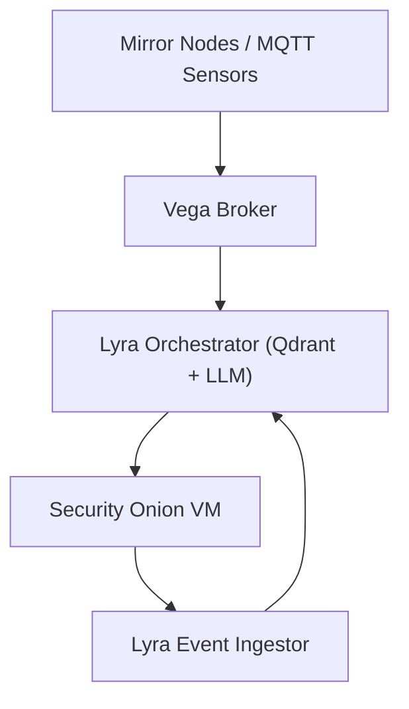

# Security Onion Integration

## Purpose
Define the planned integration between the Lyra Echo ecosystem and the existing Security Onion virtual machine for network visibility, intrusion detection, and event correlation.

---

## Context
- Security Onion Host: existing VM on the management VLAN  
- Function: network security monitoring (NSM), intrusion detection (IDS), and log aggregation  
- Primary Tools: Zeek, Suricata, Wazuh, Elastic Stack

---

## Planned Architecture



**Data Flow**
1. Inbound: Lyra receives summarized IDS/NSM events from Security Onion (via syslog or API).  
2. Outbound: Lyra exports system health, agent metrics, and MQTT anomalies to Security Onion for indexing and correlation.  
3. Optional: Vega may relay network device syslogs directly to Security Onion for host-level context.  

---

## Implementation Plan

### Phase 1 — Passive Integration
- Enable syslog output from Lyra and Vega into Security Onion.  
- Forward selected container logs (Ollama, Node-RED, MQTT broker).  
- Create a dedicated log source type (e.g., `lyra_logs`) within Elastic for structured parsing.  

### Phase 2 — Bidirectional Context
- Expose a minimal API on Security Onion to query Zeek or Suricata alerts filtered by host or VLAN.  
- Lyra ingests summarized alert feeds (daily or on demand) to provide context to the LLM.  

### Phase 3 — Correlated Analysis
- Export Security Onion metadata to Lyra’s Qdrant memory for embedding and semantic retrieval.  
- Enable a Network Agent in Lyra to perform correlation queries.  
- Use embeddings to cluster or summarize repeated network alerts over time.  

---

## Log Forwarding (Example)
```bash
docker logs --follow mqtt-broker | logger -t mqtt-broker -n securityonion.local -P 514
```

Planned automation:
- Deploy Fluent Bit or Vector on Lyra to forward container logs as structured JSON.
- Forward only: `mqtt-broker`, `fastapi-echo`, `qdrant`, `node-red`.

---

## Data Classification and Privacy
- Only system-level telemetry and anonymized metrics are shared.  
- No user text, transcripts, or embeddings are exported.  
- IDS/NSM alerts ingested by Lyra contain metadata only (timestamps, protocols, severity).  

---

## Security Controls
- Communication restricted to the management VLAN.  
- Logs transmitted via TLS or mutually authenticated syslog when available.  
- Security Onion users authenticate with local credentials; no external exposure.  
- Access and export actions recorded per `policies/audit-review.md`.

---

_Last updated: 2025-11-10_
