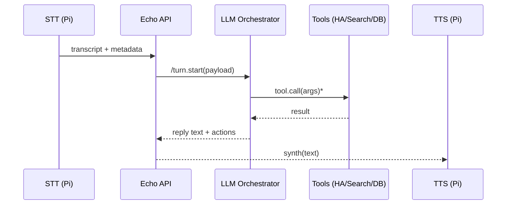

# Orchestration Layer

The orchestration layer coordinates the complete conversation turn:  
speech → text → reasoning → tool calls → speech.

---

## Objective
Provide deterministic control of every step in the interaction cycle.  
Each turn is observable, logged, and recoverable.

---

## Runtime Model
- Framework: LangChain   
- Execution: synchronous for short turns; asynchronous for tool calls  
- Transport: REST (FastAPI) for LLM queries; MQTT for edge events  
- Context: user, device, locale, permissions (injected per request)

---

## Turn Flow

---

## State Handling
- Short-term memory: in-process cache with TTL (~30 min)  
- Long-term memory: vector embeddings stored in Qdrant/Chroma  
- Structured logs: every turn persisted with latency, tokens, and tool calls

---

## Failure Handling

| Condition | Behavior |
|:--|:--|
| STT drop | Retry within 3 seconds |
| Tool timeout | Degrade to text-only answer |
| TTS failure | Display text; queue for re-synth |
| LLM timeout | Return fallback response; log |

---

## Observability
- Per-turn trace IDs propagated across all components  
- Metrics exported: total latency, token count, tool latencies, error rates  
- Planned visualization: Prometheus → Grafana dashboards

---

## Security Boundary
- All orchestration traffic stays on the orchestration VLAN  
- API endpoints require signed local tokens  
- Future: mTLS between API and nodes  

