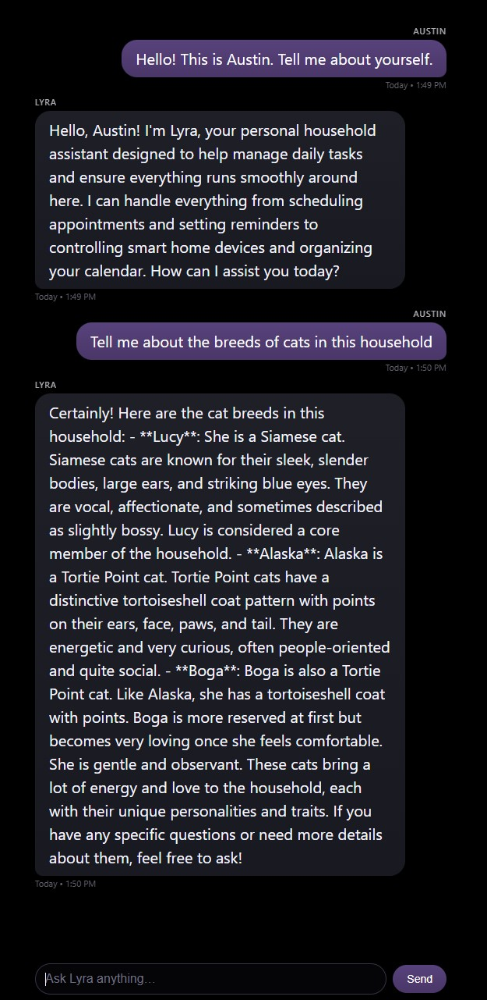

# **2025-11-22 — An Early Lyra/Echo Chat Interface**

## **Context**

Echo has always been intended as a resident-facing node. It should be a location for at-a-glance information, presence sensing/facial recognition, wake-word interactions, and lightweight conversational exchanges. I've been using the Open WebUI interface for model and persona testing but a simpler UI is more appropriate for the Echo appliance.

Today I put together the essential components for the first prototype chat interface for Lyra, for eventual deployment on the mirror display and web access on local clients. This was an important step to bringing Echo in as a legitimate conversational surface in the Lyra system. The interface communicates directly with the Lyra gateway and inherits the full persona and household memory stack. This is my first end-to-end path in which a custom interface communicates with the Lyra gateway, vLLM, and Qdrant.

The new interface is a minimal kiosk skin with an input field in place for testing purposes only. It avoids UI chrome, tool selectors, and sidebars. This iteration is intended for STT-TTS interaction, but will come to include a separate desktop interface with meta interactions and an input field. 

## **Work**

A web interface (lyra-chat.html) has been deployed on the mirror Pi. The interface uses a classic chat/text message layout rendered over #000000 to blend into the physical mirror. User messages appear in a Cyber Grape colored bubble, while Lyra’s messages appear in a darker inky gradient. Geometry is reflective of mobile interface texts/chats but might need to be adjusted for readability at a distance.

The style system is defined via CSS variables:

```css
:root {
  --bg: #000000;

  --lyra-bubble-top: #1f1f28;
  --lyra-bubble-bottom: #191922;
  --lyra-text: #f5f5ff;

  --user-bubble-top: #58427c;
  --user-bubble-bottom: #4a3668;
  --user-text: #ffffff;

  --timestamp: #7a7a88;
  --font-main: system-ui, -apple-system, BlinkMacSystemFont,
               "SF Pro Text", "Segoe UI", sans-serif;
  --max-width: 720px;
}
```

Bubble layout and spacing look good but further testing is needed once Echo goes on the wall:

```css
.bubble {
  display: inline-block;
  padding: 9px 18px;
  border-radius: 20px;
  word-wrap: break-word;
  white-space: normal;
  line-height: 1.5;
  box-shadow:
    0 0 1px rgba(255, 255, 255, 0.03) inset,
    0 4px 8px rgba(0, 0, 0, 0.25);
}
```

The interface is served on the Pi and communicates directly with the Lyra gateway using an OpenAI-compatible request structure. 

```js
const API_URL = "http://ip.addy.goes.here:9000/v1/chat/completions";
const MODEL_NAME = "Qwen/Qwen2.5-7B-Instruct";
const USER_NAME = "Austin";

const conversation = [];  // session-local only
```

The UI doesn't embed any persona or retrieval logic, it only sends messages as arrays and relies on the gateway to apply system persona, memory, and routing.


**Request Flow**

The interface collects user input, renders it, and appends it to the local session history:

```js
conversation.push({ role: "user", content: userText });
appendMessage("user", USER_NAME, userText, nowLabel());
```

It then sends a POST request to the gateway:

```js
const resp = await fetch(API_URL, {
  method: "POST",
  headers: { "Content-Type": "application/json" },
  body: JSON.stringify({
    model: MODEL_NAME,
    messages: conversation,
    stream: false
  })
});
```

The Lyra gateway receives this request at `/v1/chat/completions` and passes messages directly into the ask() function. There, the gateway extracts the user message and does a FastEmbed-based retrieval against Qdrant for relevant memory. It constructs a system message combining Lyra’s persona with context retrieved from Qdrant and then prepends it to the conversation array. The structured request is then sent to vLLM’s Qwen/Qwen2.5-7B-Instruct backend and the interaction is logged to disk.

The generated completion is returned to Echo and it extracts Lyra’s response:

```js
const lyraText = data?.choices?.[0]?.message?.content;
conversation.push({ role: "assistant", content: lyraText });
appendMessage("assistant", "Lyra", lyraText, nowLabel());
```

From that we get a clean dialogue on the mirror’s surface that reflects Lyra's persona and memory pipeline.

## **Observations**

Lyra now has a place to appear on Echo. The mirror UI retrieves accurate information about household members, pets, and other stored memory because it interacts with the same gateway-layer persona and Qdrant retrieval logic that Open WebUI uses.

The visual experience is unobtrusive and grounded, with tuned spacing and color contrast that should suitable for mirror viewing. The system runs smoothly on the Raspberry Pi and will be integrated into a custom Magic Mirror module for a unified dashboard and chat environment.

<figure markdown style="text-align:center;">
{ width="42%" }
<figcaption><em>The proto interface with Lyra's chat surface, showing early form persona/qdrant/model response from the gateway.</em></figcaption>
</figure>


## **Next Steps**

1. **Thinking & Responsiveness Improvements**  
   The interface should begin signaling that Lyra is processing a request if there is going to be latency in inference. A subtle animated ellipsis indicator will show that Lyra is active without introducing visual noise. This will bridge the moment between user action and model output in more complex queries, and be evocative of an "other person is typing" animation.

2. **Day-Start & Ambient Summary Mode**  
   Once presence sensing is available, the interface can shift smoothly into a short morning summary before the first interaction. This may include a compact briefing with weather, the first calendar item, or relevant reminders shown on approach. The goal is to surface context Lyra already holds in a way that feels natural for a hallway display.

3. **Resident Identification Pathway**  
   I've been identifying myself manually when testing the interface but a lightweight method for someone to identify themselves, like a simple prompt or selector that allows Lyra to shift context and memory toward the correct individual would be a nice addition. When authentication is later introduced, this placeholder can be expanded without redesigning the interface.

4. **Subtle Motion & Transition Polish**  
   There are visual refinements that could make conversation feel smoother. Gentle fade-ins for new messages, slight easing in scroll behavior, or brief transitions when Lyra responds will add polish. Nothing too busy, I like the minimal aesthetic for the mirror.

5. **Preparation for Multimodal Interaction**  
   As voice input, wake-word detection, and ambient audio cues are added, the interface should reserve a place for subtle visual indicators. A minimal listening icon or a quiet waveform can acknowledge that the system has entered an audio reception state. This is a detail for later, but planning for them will make it easier to implement when the time comes.

