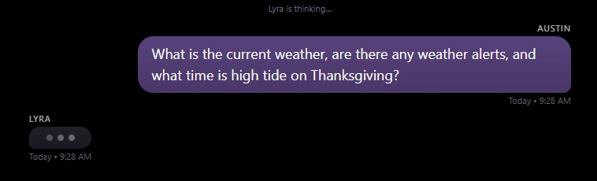
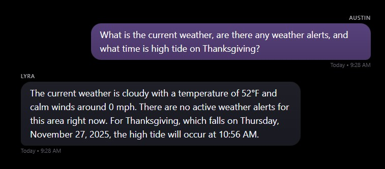

# 23 November 2025: Environmental Intelligence & Model Upgrade

## Context
This session expanded Lyra’s environmental awareness and introduced her first operational tool that retrieves live data through the gateway instead of relying on model inference or vector memory. Until now, environmental questions, weather, tides, moon phases, sunrise and sunset depended on the model’s internal knowledge, which suffers from drift and becomes inconsistent over time.

At the same time, the upgrade from Qwen-2.5 7B to Qwen-2.5 14B significantly improved reasoning quality, but the larger model brought increased latency. This created the need for more deliberate visual feedback in the Echo interface.

## Work Completed
Lyra now draws from official sources via the gateway! Gateway connects to the NOAA API to determine weather conditions now and in the future and provides that info to Lyra. 

The gateway connects to NOAA and provides Lyra with local weather forecasts, active and scheduled alerts, and high and low tide predictions from our local station. Astral provides solar and lunar data that includes sunrise, sunset, golden hours, tomorrow's solar timings, and moon phases.

All environmental data is computed or retrieved through the gateway and injected into Lyra’s context at query time, giving her insight into current real-world conditions.
A representative forecast helper:

```python
async def get_weather_forecast_summary() -> str | None:
    lat = LYRA_LOCATION.latitude
    lon = LYRA_LOCATION.longitude

    headers = {"User-Agent": NWS_USER_AGENT}

    async with httpx.AsyncClient(timeout=10.0, headers=headers) as client:
        # 1) Resolve NWS gridpoint
        r = await client.get(f"https://api.weather.gov/points/{lat},{lon}")
        r.raise_for_status()
        forecast_url = r.json()["properties"]["forecast"]

        # 2) Fetch forecast
        fr = await client.get(forecast_url)
        fr.raise_for_status()
        period = fr.json()["properties"]["periods"][0]

    temp = f"{period['temperature']}°{period['temperatureUnit']}"
    return (
        f"Forecast for {period['name']}: {temp}, {period['shortForecast']}. "
        f"Detail: {period['detailedForecast']}"
    )
```

Environment context is sourced through deterministic gateway services, not through model-driven external API access.

Tide predictions from NOAA Tides & Currents are handled in a similar way and summarized for the next couple of events:

```python
async def get_tide_summary(now_local: datetime | None = None) -> str | None:
    params = {
        "product": "predictions",
        "application": "lyra",
        "begin_date": now_local.strftime("%Y%m%d"),
        "range": "48",
        "datum": "MLLW",
        "station": TIDE_STATION_ID,
        "time_zone": "lst_ldt",
        "units": "english",
        "interval": "hilo",
        "format": "json",
    }

    async with httpx.AsyncClient(
        timeout=10.0,
        headers={"User-Agent": NWS_USER_AGENT},
    ) as client:
        r = await client.get(
            "https://api.tidesandcurrents.noaa.gov/api/prod/datagetter",
            params=params,
        )
        r.raise_for_status()
        predictions = r.json().get("predictions", [])

    # Filter to future events and keep the next two
    future_events = [...]
    return "\n".join(future_events[:2]) if future_events else None
```
The gateway then composes an environmental context block for Lyra:
```python
async def get_environment_context(user_query: str) -> str:
    tz = pytz.timezone(LYRA_LOCATION.timezone)
    now_local = datetime.now(tz)

    lines: list[str] = []
    time_block = get_time_block(now_local)
    if time_block:
        lines.append(time_block)

    # Weather / alerts / tides / holidays based on user_query
    ...
    return "\n".join(lines)
```
And that block is injected into Lyra’s system prompt at request time:
```python
env_block = await get_environment_context(user_query)
if env_block:
    system_content += "\n\nEnvironmental context:\n" + env_block

messages = [{"role": "system", "content": system_content}]
messages.extend(m.model_dump() for m in req.messages)
```

Household chronology was expanded with birthdays, anniversaries, and fixed holidays. Ages, upcoming dates, and seasonal markers are now computed explicitly in Python rather than inferred by the model. General holiday/birthday queries trigger automatic follow-up detection to surface upcoming household events.
```python
def get_upcoming_household_events(now_local: datetime, window_days: int = 60) -> list[str]:
    today = now_local.date()
    lines: list[str] = []

    for entry in HOUSEHOLD_SPECIAL_DATES:
        next_date = next_occurrence(entry["month"], entry["day"], now_local)
        delta = (next_date - today).days
        if 0 <= delta <= window_days:
            lines.append(...)

    return lines
```

The model upgrade to Qwen-2.5 14B improved clarity, stability, and reasoning depth. It also slowed down the uncannily quick response time of 7b to something a little more like latency. To address slower response speed, a typing-indicator approach was added to the mirror UI. Instead of streaming text as it's generated, the interface displays an animated ellipsis bubble in the style of a messaging app, signaling that Lyra is preparing a response. Streaming text also avoids waiting an unknown number of seconds for more complex queries to return, but it complicates the timing of the associated TTS response in the Echo interface. Streaming will be used for desktop interface and the animated ellipsis bubble is for the mirror.

Additional improvements were applied to the mirror interface, including bubble spacing, adjusted colors, and a CORS configuration for direct gateway communication.

{ .lyra-img }
{ .lyra-img }

*Animated typing ellipsis, awareness of weather, tides, and holiday dates*{ .lyra-caption }


## Observations
Grounded data dramatically improved the reliability of environmental responses. All retrieved conditions were accurate and stable, and Lyra’s phrasing remained consistent as the complexity of the environmental context increased.

Qwen-14B’s upgraded reasoning was immediately apparent in multi-step environmental and household queries. Its slower generation speed was noticeable, but the animated ellipsis effectively softened the delay and made the interface feel purposeful rather than stalled.

This shift to gateway-sourced environmental information represents Lyra’s first true operational tool, an external capability managed by the system and injected deliberately. This gives us the foundation for future data driven tooling.

## Next Steps
Environmental tooling can be extended with additional astronomical and atmospheric data, moonrise and moonset, twilight periods, barometric trends, and optional air-quality metrics. How much is really needed as Lyra isn't a weather balloon becomes the question. Similar gateway based tools can support scheduling context, routine awareness, or household automations.

For the interface, authentication and per-user profiles are planned, along with determining which responses should trigger TTS playback. As the system grows, further tuning may be needed to balance model latency with the mirror’s pacing.

Lyra’s gateway now has a clear architectural role as the source of grounded truth; upcoming work will continue reinforcing that pattern across more parts of the system.
