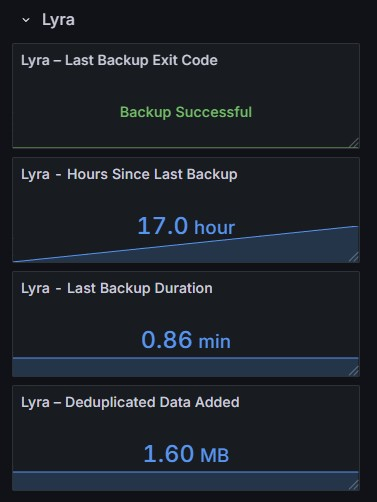

# 07 December 2025: Backups & Monitoring

## Context
While the work continues on the physical mirror build and database development, I decided to take care of some necessary disaster recovery work by implementing automated backups to the devices in the Lyra system. To accomplish this I configured <a href="https://www.borgbackup.org/" target="_blank">BorgBackup</a> automations on Lyra, Deb, and several raspberry pi's. Full system backup repositories are hosted on a NAS device via NFS. A scenario-based Disaster Recovery Runbook was also added to the documents library. End to end bare metal recovery is now possible for all nodes.

## Work
Mounted NAS NFS export on each host and created permanent `/etc/fstab` entries, and initialized encrypted Borg repositories for each device. After the backups completed I exported Borg encryption keys for all hosts.

A template backup script was applied to each device for nightly deduplication, zstd compression, and retention pruning.The script was tested and successfully performed first-run backups. Scheduling is accomplished with systemd managed automation on all machines. 

On each host, a `/etc/systemd/system/borg-backup@.service` and `/etc/systemd/system/borg-backup@<hostname>.timer` were created.
A secure passphrase was passed to root and is handled by `BORG_PASSPHRASE_FILE` usage inside the systemd unit. 
Once the passphrase was verified, deduplication and successful pruning via Borg retention policies were tested with a manual start of the service. Backups now run nightly without user interaction.

<i>borg-backup@.service</i>
```
[Unit]
Description=Borg Backup for %i
Documentation=https://borgbackup.readthedocs.io/
Wants=network-online.target
After=network-online.target

# Ensure NFS backup target is available
RequiresMountsFor=/mnt/unas

[Service]
Type=oneshot
Nice=10

# Passphrase from root-only file
Environment=BORG_PASSPHRASE_FILE=/root/.borg_passphrase

ExecStart=/bin/bash -c 'export BORG_PASSPHRASE=$(cat "$BORG_PASSPHRASE_FILE") ; /usr/local/sbin/backup_%i.sh'

StandardOutput=journal
StandardError=journal

[Install]
WantedBy=multi-user.target
```


In the runbook, two restore scenarios are documented. Scenario A, in which the disk/partitions are intact, a full Borg restore via Live USB without OS reinstall. And, Scenario B, full disaster recovery, in which we take a new/blank disk, give it a minimal OS install to create partitions, and the Borg restore.

The backups now run silently overnight. To track and verify the activity on each host, a <a href="https://grafana.com/" target="_blank">Grafana</a> dashboard was built using data piped from Borg to <a href="https://prometheus.io/" target="_blank">Prometheus</a>.  
To accomplish this, I installed and configured node_exporter on all hosts and implemented textfile collector metrics for Borg. On each host, `.prom` files were added to /var/lib/node_exporter, and scraping and metric availability was confirmed through Prometheus. 
The data in Prometheus was imported to Grafana for individual host dashboard visualizations with the last backup exit code rendered as Backup Successful, hours since last backup, last backup duration, and deduplicated data added.

<figure markdown style="text-align:center;">
{ width="42%" }
<figcaption><em>The proto interface of Lyra's backup dashboard</em></figcaption>
</figure>

## Observations
Deduplication was extremely effective across hosts; actual storage impact on the NAS is minimal after compression. NFS performance was stable and fast enough for large snapshot ingestion. The backup scripts executed cleanly with predictable runtime. Lyra’s was the longest at ~48 minutes for the initial backup. Subsequent incremental backups have been very fast. Borg’s repository integrity and list operations confirmed correct initialization and keying. The Disaster Recovery process is now logically complete, with a regular integrity verification process still needed.
Overnight the timer automation was confirmed successful and the dashboard provides real time information

## Next Steps
I'll need to add another backup schedule once the TTS node is online. 

Implement a periodic automated Borg repo health check `borg check` with email notification. 

Put together a vm for a full test restore to validate backup functionality. 

Add timestamp data to the dashboard, and make the dashboard data a little nicer looking

Add backup failure alerting

Start work on centralized logging
